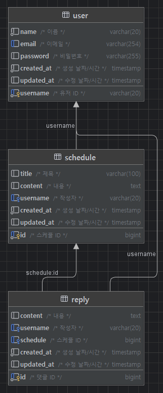

# 일정 관리 앱_develop

## 1. 프로젝트 개요
일정 및 유저 관련 CRUD를 실행하는 백엔드 API입니다.

## 2. 기술 스택
- Java 17
- MySQL 9.2
- Spring Boot 3.4.3
  - Spring Data JPA
  - Validation
- Lombok
- Bcrypt 0.10.2
- Gradle

## 3. ERD


## 4. API 명세서

### 4.1. 일정 생성

- 메서드: `POST`
- URL: `/schedules`
- Request Body
  ```json
  {
    "title": "제목1",
    "date": "2025-03-25",
    "content": "내용1",
    "username": "user1",
    "password": "1234",
    "status": true
  }
  ```
- Response
  ```json
  {
    "id": 6,
    "title": "제목1",
    "date": "2025-03-25",
    "content": "내용1",
    "username": "user1",
    "status": true,
    "created_at": null,
    "updated_at": null
  }
  ```
  (`created_at`, `updated_at` 컬럼은 DB에서 생성되므로 Response에는 들어있지 않습니다.)
- Response Code: `201 Created`, `400 Bad Request`

### 4.2. 일정 단건 조회

- 설명: `Path Variable`로 전달된 `ID`에 해당하는 일정을 조회합니다.
- 메서드: `GET`
- URL: `/schedules/1`
- Response
  ```json
  {
    "id": 1,
    "title": "제목123",
    "date": "2025-04-01",
    "content": "내용123",
    "username": "user1",
    "status": true,
    "created_at": "2025-03-24T06:21:06.000+00:00",
    "updated_at": "2025-03-26T11:07:05.000+00:00"
  }
  ```
- Response Code: `200 OK`, `400 Bad Request`

### 4.3. 일정 수정

- 설명
    - `Path Variable`로 전달된 `ID`에 해당하는 일정을 수정합니다.
    - 비밀번호가 일치할 경우에만 수정을 실행합니다.
- 메서드: `PATCH`
- URL: `/schedules/1?password=1234`
- Request Body
  ```json
  {
    "title": "제목변경",
    "date": "2025-04-01",
    "content": "내용변경",
    "status": true
  }
  ```
- Response
  ```json
  {
    "id": 1,
    "title": "제목변경",
    "date": "2025-04-01",
    "content": "내용변경",
    "username": "user1",
    "status": true,
    "created_at": "2025-03-25T06:24:31.000+00:00",
    "updated_at": "2025-03-27T00:19:50.000+00:00"
  }
  ```
- Response Code: `200 OK`, `400 Bad Request`

### 4.4. 일정 삭제

- 설명
    - `Path Variable`로 전달된 `ID`에 해당하는 일정을 삭제합니다.
    - 비밀번호가 일치할 경우에만 수정을 실행합니다.
- 메서드: `DELETE`
- URL: `/schedules/1?password=1234`
- Response Code: `303 See Other`, `400 Bad Request`